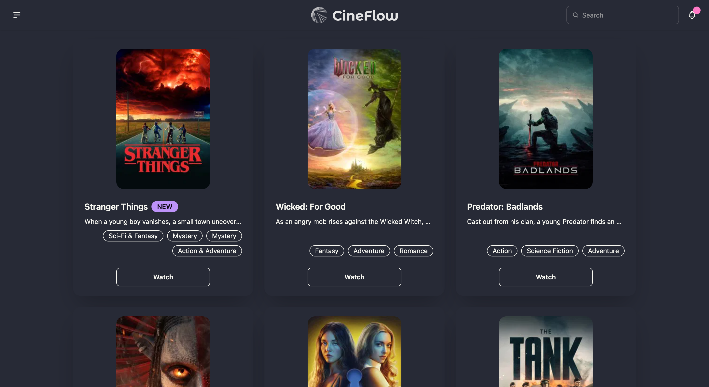

# 🎬 CineFlow – The Movie Catalog

CineFlow is a modern and responsive movie catalog web application built using **React, TypeScript, and TMDB API**. It allows users to explore trending movies, discover content by categories, and view movie details in a clean, user-friendly interface.

## 🚀 Features

<!-- - 🔥 Browse **Trending Movies & TV Shows** -->
<!-- - 🎭 Explore movies by **genre/category** -->
<!-- - 🔍 Search for movies in real-time -->
- 🖼️ View posters, ratings, and titles
- ⚡ Fast and smooth Single Page Application (SPA)
- 📱 Fully **responsive** for all devices
- 🎨 Clean UI with **DaisyUI + Tailwind CSS**

## 🛠️ Technologies Used

- **React.js** – Frontend library
- **TypeScript** – Type safety & better developer experience
- **Axios** – API data fetching
- **TMDB API** – Movie database
- **Tailwind CSS** – Utility-first styling
- **DaisyUI** – Prebuilt Tailwind components
- **React Router DOM** – Routing
- **Single Page Application (SPA)**
- **Responsive Design**

## 📦 Installation & Setup

Follow these steps to run the project locally:

### 1️⃣ Clone the repository
- git clone https://github.com/Nitesh-Kumar-7557/cineflow
- cd cineflow

### 2️⃣ Install dependencies
- npm install

### 3️⃣ Create .env file
- Create a .env file in the root directory and add:
- VITE_TMDB_API_KEY = your_tmdb_api_key_here
- 🔐 Get your API key from: https://www.themoviedb.org/

### 4️⃣ Start the development server
- npm run dev

## 🌐 Live Demo
👉 Live Website: [https://cineflow-dev.vercel.app](https://cineflow-dev.vercel.app/)

## 📂 Project Structure

cineflow/
├── node_modules/
├── src/
    ├── api/
    │   ├── axios.ts
    │   └── requests.ts
    ├── assets/
    │   ├── logo-black.svg
    │   └── logography.svg
    │   └── screenshot.png
    ├── components/
    │   ├── Navbar.tsx
    │   └── TrendingSection.tsx
    ├── pages/
    │   └── Home.tsx
    ├── types/
    │   ├── genre.ts
    │   └── movie.ts
    ├── App.tsx
    ├── index.css
    └── main.tsx

## 📸 Screenshots

## 🧑‍💻 Author
**Nitesh Kumar**
Frontend Developer
GitHub: https://github.com/Nitesh-Kumar-7557

## ⭐ If you like this project, give it a star!